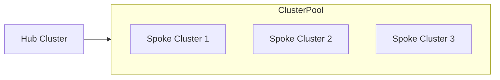

# rhoai-cluster-pool

Uses Hive ClusterPool's from a HUB cluster to provision roadshow SPOKE clusters.



SPOKE clusters auto-provision from the HUB. All you should need to do is scale the ClusterPool and wait for install + setup.

## Bootstrap a Hub Cluster

- [Ansible Installer](bootstrap/ansible/README.md)

```bash
cd bootstrap/ansible
ansible-playbook -i hosts rhoai-roadshow.yaml
```

Claim a spoke cluster

```bash
cat <<EOF | oc apply -f -
apiVersion: hive.openshift.io/v1
kind: ClusterClaim
metadata:
  name: road1
  namespace: cluster-pools
spec:
  clusterPoolName: openshift-roadshow
  subjects:
    - kind: Group
      apiGroup: rbac.authorization.k8s.io
      name: 'system:masters'
EOF
```

Scale the ClusterPool

```bash
# now scale pool to zero - else we get another standby spinning up
oc scale clusterpool openshift-roadshow -n cluster-pools --replicas=0

# scale to one to get standby cluster
oc scale clusterpool openshift-roadshow -n cluster-pools --replicas=1
```

Setup Hive (manual)

- [Hive Setup](HIVE_SETUP.md)

AWS Quota (needed for deploying spokes)

- [AWS Quota](AWS_QUOTAS.md)
