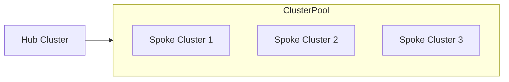
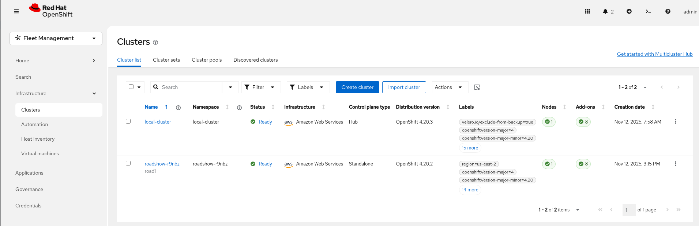
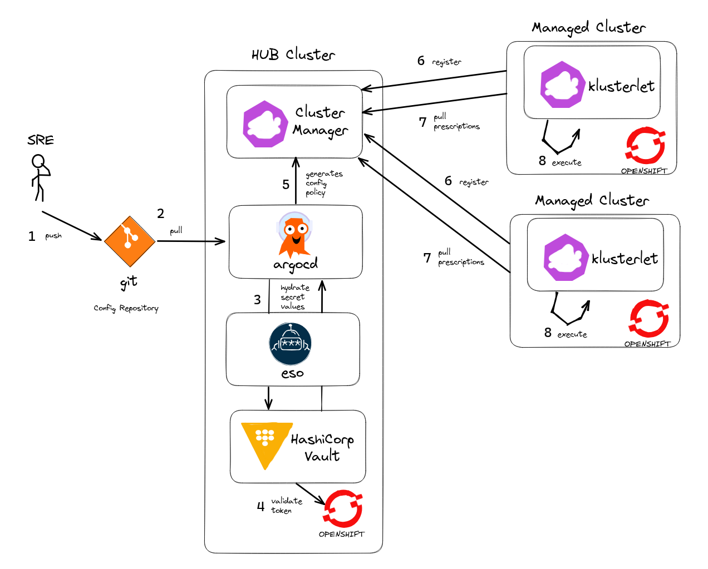
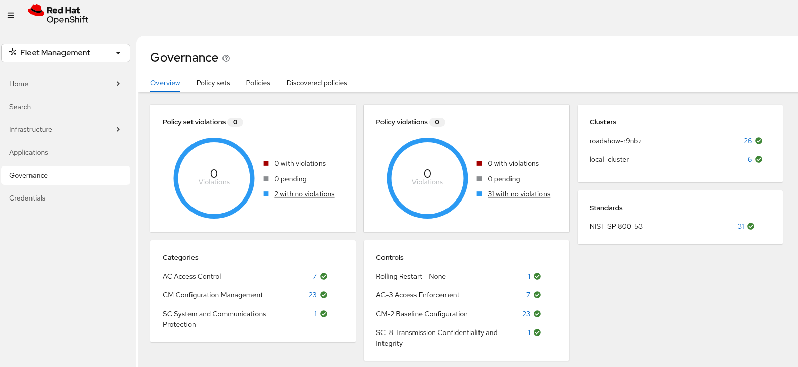

# rhoai-cluster-pool

Uses [Hive ClusterPool's](https://github.com/openshift/hive/blob/master/docs/clusterpools.md) from a HUB cluster to provision [Roadshow](https://odh-labs.github.io/rhoai-roadshow-v2/#/) SPOKE clusters.



SPOKE clusters auto-provision from the HUB. All you should need to do is scale the ClusterPool and wait for install + setup.



## Bootstrap a Hub Cluster

- [Ansible Installer](bootstrap/ansible/README.md) check here for environment needed to install

```bash
# set environment variables
cd bootstrap/ansible
ansible-playbook -i hosts rhoai-roadshow.yaml
```

Scale the ClusterPool (also a selector in ACM UI > ClusterPools for this)

```bash
# now scale pool to zero - else we get another standby spinning up
oc scale clusterpool openshift-roadshow -n cluster-pools --replicas=0

# scale to one to get standby cluster
oc scale clusterpool openshift-roadshow -n cluster-pools --replicas=1
```

Claim a spoke cluster (also a button in ACM UI > ClusterPools for this) - the spoke cluster auto-configures itself using ACM Policy.

```bash
cat <<EOF | oc apply -f -
apiVersion: hive.openshift.io/v1
kind: ClusterClaim
metadata:
  name: road1
  namespace: cluster-pools
spec:
  clusterPoolName: openshift-roadshow
  subjects:
    - kind: Group
      apiGroup: rbac.authorization.k8s.io
      name: 'system:masters'
  # lifetime: 24h
EOF
```

Once Claimed - a spoke cluster will take approx ~20-30 min to join the HUB and configure itself for the Roadshow.

AWS Quota (needed for deploying spoke clusters)

- [AWS Quota](AWS_QUOTAS.md)

Troubleshooting

- [Troubleshooting Guide](TROUBLESHOOTING.md)

Setup Hive (manual steps for information purposes only)

- [Hive Setup](HIVE_SETUP.md)

OpenShift 4 needs some extra steps if you intend to shutdown the cluster prior to the 24hr cert rotation period (post install)

- [Early Shutdown](EARLY_SHUTDOWN.md)

To destroy your HUB cluster:

```bash
cd /tmp/ansible.xxx
openshift-install destroy cluster --dir=cluster
```

Keep a copy of your `/tmp/ansible.xxx` folder for future OpenShift cluster uninstalls e.g.

```bash
mv /tmp/ansible.xxx ~/sno-roadshow
```

## Governance & Secrets Pattern

We use the External Secrets operator with [custom resource sync](https://github.com/external-secrets/external-secrets/blob/main/design/012-sync-to-custom-resource.md) to hydrate secret values from Vault.



GitOps + ACM + Policy + PolicyGenerator are used to manage applications across all clusters with zero configuration drift.


