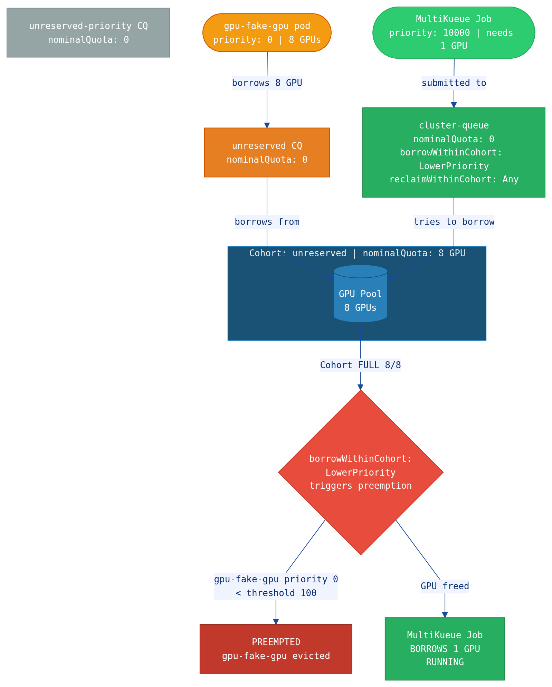
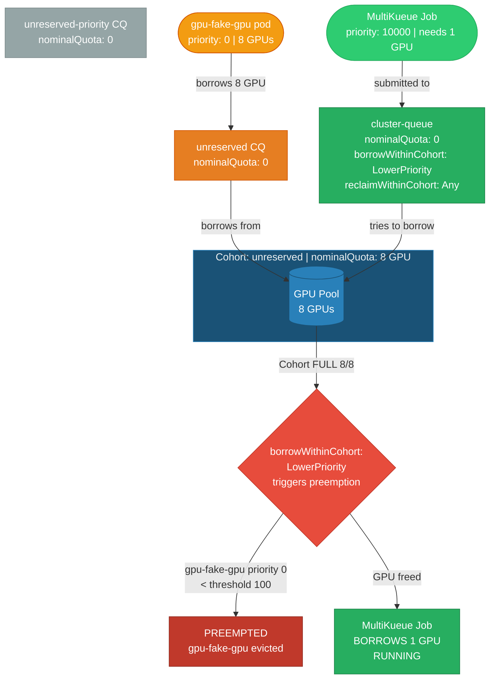

# MultiKueue Preemption Flow

## Key Configuration

- **Cohort** `unreserved` owns the GPU pool (`nominalQuota: 8`)
- **All ClusterQueues** have `nominalQuota: 0` — they borrow from the Cohort
- **`cluster-queue`** has `borrowWithinCohort: LowerPriority` (threshold 100) and `reclaimWithinCohort: Any`
- CQ nominals are **ADDITIVE** to Cohort — any non-zero nominal inflates total capacity and breaks preemption

## Mermaid Source

